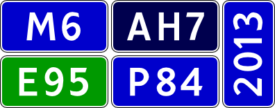

Russian road sign font
======================

The Font which used for road signs in USSR and Russia.
It was described in Soviet state standard GOST 10807-78 and
in modern Russian state standard GOST R 52290-2004.

Available glyphs
----------------

GOST R 52290-2004 contains samples of 140 glyphs placed on coordinate grid,
GOST 10807-78 describes 420 glyphs, same as above plus letters from non-Russian
alphabets used in USSR and Russia.
By January 9, 2019 this font contains 1099 characters including:

* Digits and punctuation signs: 20 glyphs + 2 references = 22 of 22 defined in GOST
* Latin alphabet: 51 (+43) = 94 of 94
* Cyrillic alphabet: 97 (+64) = 161 of 161
* ~~Armenian alphabet:~~ 1 (+11) = 12 of 77 (15 %)
* ~~Georgian alphabet:~~ 0 of 66

Additional glyphs which are not described by specified standards:

* Digits and punctuation signs: 38 (+67) = 105
* Latin alphabet and IPA: 38 (+442) = 480
* Cyrillic alphabet: 33 (+30) = 63
* Greek alphabet: 13 (+135) = 148
* other: 10 (+4) = 14

Font contains all digits (normal size, subscript, superscript)
and letters of Cyrillic and Latin alphabets as described in standards.
Also font contains full visible part of ASCII.

Supported languages:
Abaza, Abkhasian, Adyghe, Aghul, Altai, Avar, Azerbaijani (Cyrillic and Latin),
Bashkir, Bulgarian, Buryat, Byelorussian, Chechen, Chukchi, Chuvash, Crimean
Tatar (Cyrillic), Croatian, Czech, Danish, Dargin, Dolgan, English, Esperanto,
Estonian, Even, Evenki, Finnish, French, German, Hungarian, Icelandic, Ingush,
Italian, Kabardian, Kalmyk, Karachay Balkar, Karelian, Kazakh, Khakassian,
Khanty, Kirghiz, Komi, Kumyk, Lak, Latin, Latvian, Lezgian, Lithuanian,
Macedonian, Mansi, Mari (with Hill Mari), Moldovan (Cyrillic and Latin),
Mongol, Mordvinic, Nenets, Nogai, Norwegian, Ossetian, Polish, Portuguese,
Romanian, Russian (modern and pre-Revolution), Rutul, Selkup, Serbian, Spanish,
Swedish, Tabasaran, Tadjik, Tat, Tatar, Tsakhur, Turkish, Turkmen (Cyrillic and
Latin), Tuvan, Udmurt, Ukrainian, Uzbek (Cyrillic and Latin), Veps, Yakut.

Author
------

Digitized by [Alexander Sapozhnikov](http://shoorick.ru/), <shoorick@cpan.org>.

Licence
-------

[CC-BY-SA](http://creativecommons.org/licenses/by-sa/3.0/)

Proprietary analog
------------------

* IndorSoftRoadSignLetters.ttf from
[IndorRoadSigns](http://www.indorsoft.ru/products/roadsigns/) program.

--------------------------------------------------
_The same in Russian:_

Шрифт российских дорожных знаков
================================

Шрифт, используемый в дорожных знаках СССР и России.
Описан в советском ГОСТ 10807-78 и действующем российском ГОСТ Р 52290-2004.

Доступные символы
----------------

ГОСТ Р 52290-2004 содержит образцы 140 глифов, размещённых на координатной
сетке: русский и латинский алфавиты, цифры и знаки пунктуации.
ГОСТ 10807-78 содержит 420 глифов — туда также входят символы, используемые в
языках народов СССР и России.
Этот шрифт по состоянию на 09.01.2019 содержит 1099 символов, в том числе:

* Цифры и знаки пунктуации: 20 глифов + 2 ссылки = 22 из 22, описанных в ГОСТ
* Латинский алфавит: 51 (+43) = 94 из 94
* Кириллица: 97 (+64) = 161 из 161
* ~~Армянский алфавит:~~ 1 (+11) = 12 из 77 (15 %)
* ~~Грузинский алфавит:~~ 0 из 66

Не определены в стандартах, но есть в шрифте:

* Цифры и знаки пунктуации: 38 (+67) = 105
* Латинский алфавит и МФА: 38 (+442) = 480
* Кириллица: 33 (+30) = 63
* Греческий алфавит: 13 (+135) = 148
* прочее: 10 (+4) = 14

В шрифте представлены все цифры (обычного размера, верхние и нижние индексы),
а также предусмотренные указанными стандартами буквы кириллического и латинского
алфавитов. Кроме того, шрифт содержит все видимые символы ASCII.

Поддерживаемые языки:
абазинский, абхазский, аварский, агульский, адыгейский, азербайджанский (оба
алфавита — кириллический и латинский), алтайский, английский, башкирский,
белорусский, болгарский, бурятский, венгерский, вепсский, даргинский, датский,
долганский, ингушский, исландский, испанский, итальянский,
кабардино-черкесский, казахский, калмыкский, карачаево-балкарский, карельский,
киргизский, коми, крымскотатарский (кириллица), кумыкский, лакский, латинский,
латышский, лезгинский, литовский, македонский, мансийский, марийский
(с горномарийским), молдавский (оба алфавита), монгольский, мордовский,
немецкий, ненецкий, ногайский, норвежский, осетинский, польский, португальский,
румынский, русский (современный и дореволюционный), рутульский, селькупский,
сербский, табасаранский, таджикский, татарский, татский, тувинский, турецкий,
туркменский (оба алфавита), удмуртский, узбекский (оба алфавита), украинский,
финский, французский, хакасский, хантыйский, хорватский, цахурский, чеченский,
чешский, чувашский, чукотский, шведский, эвенский, эвенкийский, эсперанто,
эстонский, якутский.

Проприетарный аналог
--------------------

* IndorSoftRoadSignLetters.ttf из программы
[IndorRoadSigns](http://www.indorsoft.ru/products/roadsigns/).
